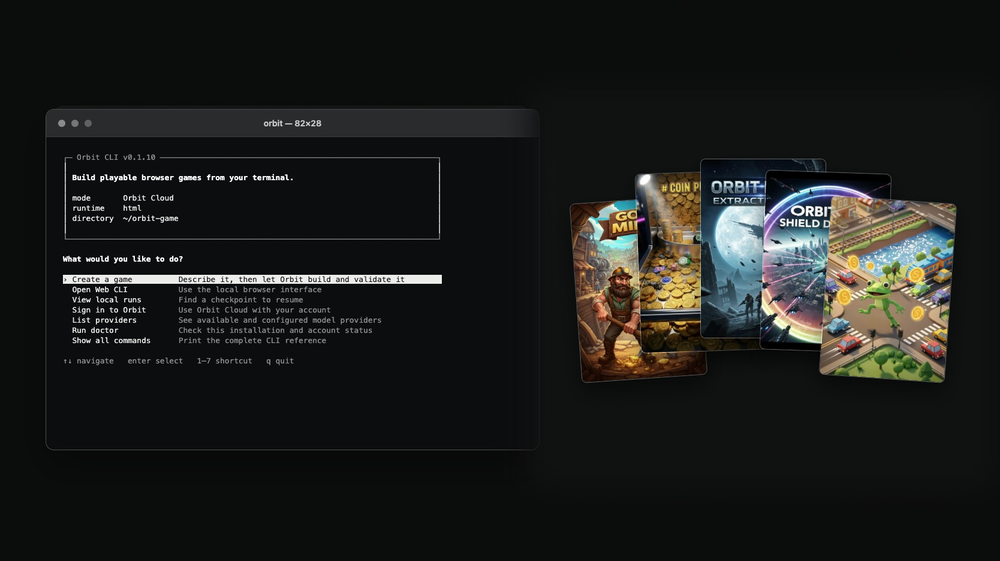

<h1 align="center">Orbit CLI</h1>

<p align="center"><strong>A local game-building agent that turns prompts into playable browser games.</strong></p>

<p align="center">
  
</p>

<p align="center">
  Open source and local first. Build, validate, resume, and publish from your terminal.
</p>

<p align="center">
  <a href="README.md"><strong>English</strong></a> · <a href="README.zh-CN.md">简体中文</a>
</p>

<p align="center">
  <a href="https://www.npmjs.com/package/@soda_game/orbit-cli"></a>
  <a href="https://github.com/soda-game-org/orbit-cli/actions/workflows/ci.yml"></a>
  <a href="LICENSE"></a>
  <a href="https://www.npmjs.com/package/@soda_game/orbit-cli"></a>
</p>

<p align="center">
  <a href="#quickstart">Quickstart</a> ·
  <a href="https://orbit-arcade.com">Play on Orbit Arcade</a> ·
  <a href="https://github.com/soda-game-org/orbit-cli/releases">Releases</a> ·
  <a href="https://orbit-arcade.com/orbit-engine">Orbit Engine</a>
</p>

---

## What Orbit CLI does

Orbit CLI runs the game-building loop on your machine while you choose how models and generated assets are accessed.

| Capability | What it means |
| --- | --- |
| Agentic game building | Plans the loop, writes the project, validates the playable, and keeps working through tool calls. |
| Interactive terminal or local Web CLI | Keep iterating in one terminal session with live status, commands, and local history, or open `orbit web` for a graphical workflow. |
| Orbit Cloud or BYOK | Sign in with Orbit OAuth, or bring supported provider keys stored in your operating-system vault. |
| Images and 3D in the same run | Attach references and let the agent produce selected image or GLB assets alongside the game code. |
| Checkpointed and explicit | Resume interrupted work safely; publishing only happens when you run `orbit publish`. |

## Quickstart

### Install Orbit CLI

Orbit CLI requires Node.js 22 or newer.

```sh
npm install --global @soda_game/orbit-cli
```

To work from source instead:

```sh
git clone https://github.com/soda-game-org/orbit-cli.git
cd orbit-cli
npm ci --ignore-scripts
npm link
```

Check your setup:

```sh
orbit doctor
```

Or run `orbit` with no arguments to open the keyboard-driven launcher:

```sh
orbit
```

Choose **Create a game** to enter a persistent terminal session. It starts in the current directory, accepts follow-up requests without exiting, keeps the active workspace/model/runtime visible, and collapses live agent work into a final result when each run ends. The other launcher actions open the Web CLI, local runs, account login, provider list, diagnostics, and command reference.

The default runtime is `auto`: after creating its execution plan, the coding agent records a structured runtime decision before it may modify the project. It weighs dimension, camera, rendering, controls, physics, existing source, delivery constraints, and maintainability. Genre words and skill labels do not hard-code a framework; `--runtime html|vanilla-ts|react-vite|react-three-fiber|three-vanilla|phaser` remains an explicit user constraint.

Inside the session, type a request naturally or use the discoverable command palette:

```text
/new ./my-game
/images on
› Build a replayable mobile arcade game
› Make the first round easier and improve the score feedback
/details
/web
```

Type `/help` for all session commands. Tab completes slash commands, arrow keys recall earlier input, requests typed while the agent is busy are queued for the next turn, `/resume` continues the latest resumable checkpoint, and Ctrl+C interrupts the active run without discarding the session. Scripted commands such as `orbit generate` keep their stable JSON output for automation.

### Projects and sessions

Orbit treats a local workspace as one **Project**. A Project can contain multiple independent **Sessions** (internally, Threads); every request is a **Turn**, and each execution or retry is a checkpointed **Run/Attempt**. Starting another Session keeps the same files but gives the agent a separate conversation history. Starting another Project selects a different workspace.

Use these commands inside the terminal session:

```text
/sessions
/session new Explore another gameplay direction
/session <id-or-unique-prefix>
/new ./another-game
```

In the local Web CLI, **New chat** creates another Session in the selected Project, while **New project** selects a separate workspace. The first Turn in a new Session for an existing game is still an edit of that Project; it does not recreate or replace the workspace. Legacy `runs/<id>/checkpoint.json` and `events.jsonl` remain in place and are indexed lazily, so upgrading does not move, delete, or rewrite old run history.

### Create your first game

Sign in with your Orbit account:

```sh
orbit auth login
```

Sign-in opens Orbit's first-party authorization page and then uses the existing
Google OAuth PKCE flow. Check Cade or open the account and billing pages at any
time:

```sh
orbit account
orbit account open
orbit account billing
```

The launcher and Web CLI show the latest available Cade balance. A low balance
is a warning; an exhausted balance pauses the next Orbit Cloud provider step
without deleting the local checkpoint. BYOK runs are not blocked by Orbit Cade.

Then describe the game you want to build:

```sh
orbit generate \
  --workspace "$PWD/my-game" \
  --prompt "Build a replayable mobile arcade game"
```

Prefer a graphical interface? Open the local Web CLI:

```sh
orbit web
```

### Build-command safety

Orbit does not run project code by default. Some generated projects need a local dependency install or build; enable that only after reviewing the workspace:

```sh
orbit resume <run-id> --allow-shell
```

The command boundary is intentionally narrow and uses an isolated HOME and npm cache, but the project's own `build` script still runs with your operating-system user's filesystem permissions. Treat `--allow-shell` as permission to execute the generated project, not as a sandbox.

## Choose how models are accessed

Orbit CLI offers two model routes. Sign in with Orbit OAuth to use Orbit Cloud and Orbit billing, or use your own API key for OpenRouter, OpenAI, DeepSeek, Zhipu BigModel (China), Z.AI (Global), Volcengine Ark, Kimi (China), or Kimi (Global). A Replicate key gives the game-development agent access to image and 3D asset generation in BYOK runs.

```sh
orbit providers set openrouter
orbit providers list
orbit providers models openrouter

orbit generate \
  --mode byok \
  --provider openrouter \
  --workspace "$PWD/my-game" \
  --prompt "Build a fast neon racing game"
```

OpenRouter models are selected by model ID rather than a hard-coded list; the catalog command shows models that advertise tool support. You can still enter another model ID directly. Regional Zhipu and Kimi services use separate endpoints and separate stored keys.

Provider keys and Orbit sessions are stored in your operating system's credential vault. Large sessions are split across authenticated vault entries on Windows so they remain within Credential Manager's per-entry limit; there is no plaintext fallback. For automation, use `--key-stdin` instead of putting a key in shell history.

## Images and 3D

Add PNG, JPEG, or WebP references to a game:

```sh
orbit generate \
  --workspace "$PWD/my-game" \
  --prompt "Use this character and visual direction" \
  --attach /absolute/path/character.png
```

Each attachment occurrence is a separate Turn input with a stable identity,
even when two occurrences share the same verified image bytes. A
vision-capable selected model receives bounded image parts transiently in the
provider request. Text-only models use a separate, identity-bound structured
observation; Orbit does not concatenate every image into one startup summary.
Image bytes and local paths are not stored in the conversation transcript, and
private image context is never forwarded across provider boundaries.

Let the game-development agent plan and generate image assets alongside the game code:

```sh
orbit generate \
  --mode byok \
  --provider openrouter \
  --workspace "$PWD/my-game" \
  --prompt "Build a polished neon racing game" \
  --images
```

With Orbit OAuth, the same tool uses the authenticated Orbit Worker and Orbit billing. In BYOK mode, it uses the Replicate key stored in the operating-system vault and the user's Replicate billing. The agent decides whether a small number of high-impact images will improve the game, writes verified PNG files into the workspace, references them from the final build, and checkpoints paid work for recovery. The two billing routes never silently fall back to one another.

`orbit image` remains available as a small convenience command, but Orbit CLI's primary workflow is the coding agent run above: game code, images, 3D models, and other assets are produced together for the requested game.

Generate a GLB asset with Orbit or your Replicate account:

```sh
orbit 3d \
  --mode orbit \
  --workspace "$PWD/my-game" \
  --prompt "A stylized low-poly spacecraft" \
  --output assets/models/spacecraft.glb
```

## Resume and publish

Orbit saves local checkpoints so interrupted work can continue:

```sh
orbit runs
orbit resume <run-id>
```

In an interactive session, `/sessions` lists conversation histories for the active Project, `/session <id>` switches between them, `/runs` shows recent checkpoints, `/resume [run-id]` continues one, and `/details [run-id]` expands its saved plan and tool timeline on demand. Completed work otherwise stays collapsed into the final summary.

If the project folder moved, explicitly rebind every checkpoint for that workspace instead of editing local JSON by hand:

```sh
orbit runs relocate <run-id> --workspace /absolute/path/to/moved-game
```

The Web CLI exposes the same operation as **Relocate folder** on each run. The replacement must be an existing real directory. Orbit updates local checkpoint references only; it never moves project files or publishes anything.

When your game is ready, publish it to [Orbit Arcade](https://orbit-arcade.com):

```sh
orbit publish <run-id>
```

Before upload, the CLI reads Orbit's authenticated, versioned publish contract
and verifies its SHA-256 digest. A completed run also records optional local
store media under `.orbit/artifacts/store/`: a 3:4 listing cover and a square
app icon. If image generation was enabled, the host attempts these after the
playable game passes validation; failures never turn a valid game into a failed
run. `orbit publish` uploads verified local media when present, while the Orbit
service stores it in R2. When media is absent (including text-only BYOK setups),
the server keeps the existing non-blocking cover/icon backfill behavior.

Publishing is always an explicit step and requires an Orbit login.

## Docs

- Run `orbit` for the interactive launcher, or `orbit --help` for the complete command reference.
- Run `orbit capabilities` to see the features available in your installed version.
- Read the [security policy](SECURITY.md).
- Review the [release-integrity policy and historical tag notice](RELEASES.md).
- Browse source tags and release notes on [GitHub Releases](https://github.com/soda-game-org/orbit-cli/releases).

## TypeScript development

Orbit CLI keeps its maintained source, tests, build tooling, and release audit in TypeScript. Compiled ESM is created in the ignored `dist/` directory only during build and packaging, so the repository remains source-first while npm installs run without a TypeScript runtime.

```sh
npm run dev -- --help
npm run typecheck
npm test
npm run build
npm run check
```

`npm run typecheck` applies the strict product-code configuration. `npm test` executes the TypeScript test suite directly with `tsx`, while `npm run check` also builds the distributable and audits the exact npm package contents.

Developed by **SODA GAME**. Licensed under the [MIT License](LICENSE).
